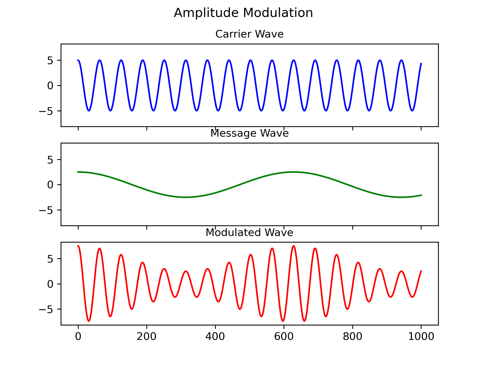
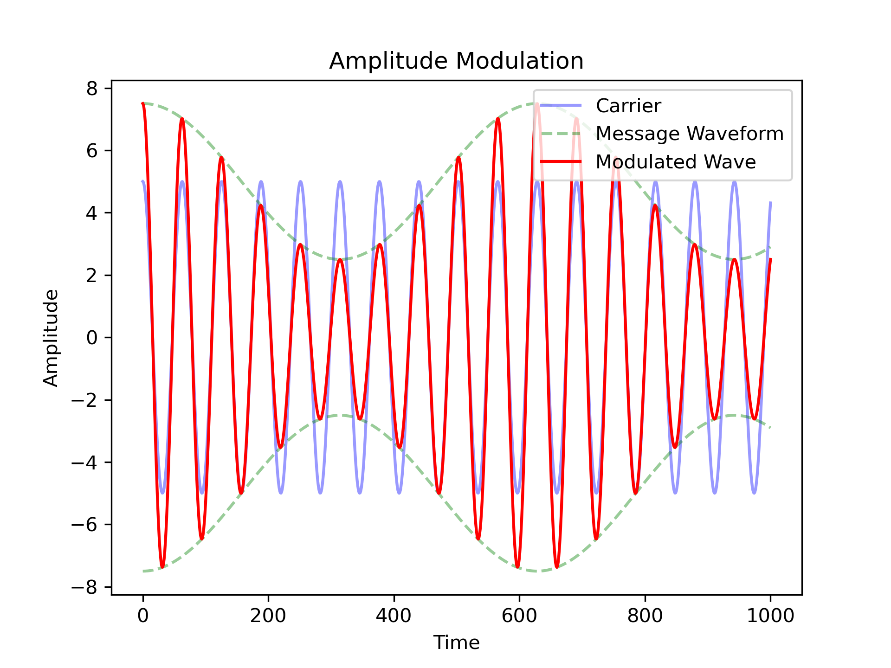

# Modulation

For this project we're only going to look at AM (amplitude modulation). Therefore the frequency of our incoming signal will be constant. This makes the circuit simplier. 

## AM Modulation

## De-Modulation
