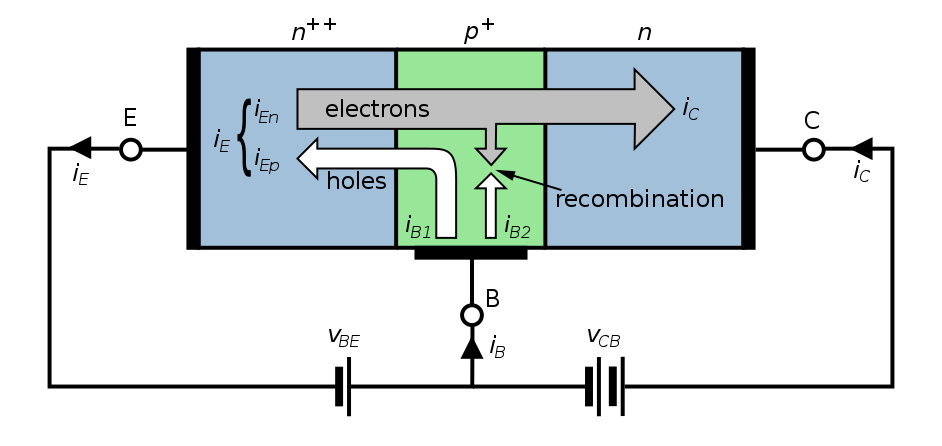

# Transistors

This file contains some notes on transistors, mainly as commonemitteramplifies and biasing.

The file experiments.md contains some experiments done with tranistors (based on EE105).

## Transistors as Amplifiers

A transistor can either act as a switch or an amplifier. For simplicity we'll only consider npn BJT transistors.

When $V_B>V_C$, the transistor acts as a switch as is in 'saturation'mode. Negative charge flows from the collector to the emitter.

When $V_C>V_B>V_E$, the transistor is in active mode.

